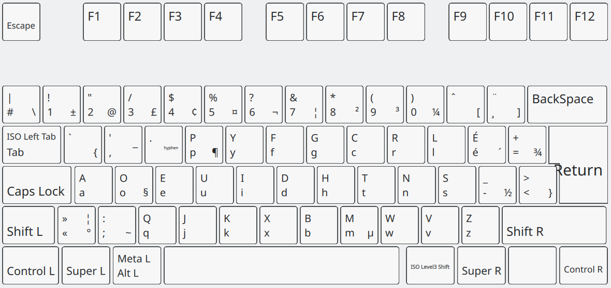

# Dvorak - Français (Canada) - Windows

## Un petit mot sur cette disposition (English Follows)

Cette disposition est une implémentation directe pour **Windows** de la disposition clavier **_Dvorak - Français (Canada)_** qui est disponible dans la majorité des distributions **GNU/Linux**.

**_Dvorak - Français (Canada)_** est, l'analogue **Dvorak** du clavier **_Français (Canada)_** dans le monde des dispositions **QWERTY**. Cette disposition fait emploi de _dead keys_ afin de permettre à l'utilisateur de mettre des accents. Cette manière de faire est ressemblante au clavier QWERTY **_Français (Canada)_**, à l'opposé du clavier **Canadien Multilingue Standard**, qui possède des touches dédiées aux lettre à accents.
## A Word on This Keyboard Layout
This keyboard layout is a direct **Windows** implementation of the **_Dvorak - French (Canada)_** layout which ships with a large number of GNU/Linux distributions. 

**_Dvorak - Français (Canada)_** is the **Dvorak** analogue of the **_French (Canada)_** layout in the **QWERTY** world. The layout uses _dead keys_ to allow the user to input various accented characters, as opposed to the **Canadian Multilingual Standard** layout which uses dedicated keys for accented characters.

